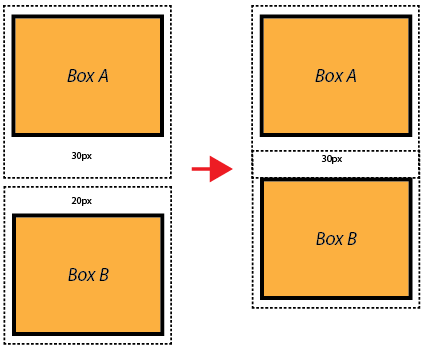

A thorough understanding of the CSS box model is key to mastering web design.
The box model concept dictates how elements are displayed and how
they interact with each other. Think of each element on the page as a
rectangular box, with the space that box takes up depending on its content, padding,
borders, and margins.

##Intro to the Box Model

Every element has a display value. This value varies with the type
of element. Most elements default to either block or inline display. Block-level
elements, like divs, paragraphs, and heading tags, form a separate block that
takes up the full width of the parent element and creates a new line before
and after the element. Inline elements, like spans, images, and links,
only take up as much width as they need to. The box model is primarily
concerned with block-level elements.

##Content
The core component of the box model is the content area, the area
containing the element's actual content. Each element starts with content,
like text or an image, and this content is placed inside a box that is just big
enough to contain it.

##Padding
[Padding](https://developer.mozilla.org/en-US/docs/Web/CSS/padding "Padding on MDN")
surrounds the content and creates space in the box. Padding is transparent,
with no color of its own, so we can use it to separate the content from the surrounding
border area. When the content area has a background, color, or image set on it,
it will extend into the padding. You can think of the padding as extending the content.

##Border
The [border](https://developer.mozilla.org/en-US/docs/Web/CSS/border "Border on MDN"),
the outermost part of the box, is a line that surrounds the padding. This line provides
visual separation between your content and the other elements on the same page.

##Margin
[Margins](https://developer.mozilla.org/en-US/docs/Web/CSS/margin "Margin on MDN")
extend from the border and exist outside the box. We can use margins
to create space around an element and separate it from neighboring boxes. Like
padding, margins are completely invisible. With no background color, margins
will not obstruct elements behind them. We can think of padding as part of the
element, while the margin surrounds the element and buffers it from the things
around it.

##Margin Collapse
The top and bottom margins of stacked boxes are sometimes combined into a single
margin, whose size is the largest of the two margins. This behavior is known as
[margin collapse](https://developer.mozilla.org/en-US/docs/Web/CSS/margin_collapsing "Margin Collapse on MDN"). This happens when margins collide and the browser prioritizes
the larger of the two margins. This means that the actual space required to place
an element would not necessarily extend from the margin of an element existing on
the page. Only the biggest margin will apply, so we would give the new element
enough margin to compensate for margin collapse.

##Determining Box Size
The values we set for an element's width and height are rarely equal to the amount
of space the browser uses to display the box. We are actually just defining the
content area itself. The actual amount of space taken up by the box is the sum
of the content's width or height, padding, borders, and margins. When calculating
width, we add the content's width to the horizontal padding, borders, and margins.
When calculating height, we add the content's height to the vertical padding,
borders, and margins.

If the CSS box-sizing property is set to default, the content's size is controlled
by [width](https://developer.mozilla.org/en-US/docs/Web/CSS/width "width on MDN"), [min-width](https://developer.mozilla.org/en-US/docs/Web/CSS/min-width "min-width on MDN"), [max-width](https://developer.mozilla.org/en-US/docs/Web/CSS/max-width "max-width on MDN"), [height](https://developer.mozilla.org/en-US/docs/Web/CSS/height "height on MDN"), [min-height]( https://developer.mozilla.org/en-US/docs/Web/CSS/min-height "min-height on MDN"), and [max-height](https://developer.mozilla.org/en-US/docs/Web/CSS/max-height "max-height on MDN"). If no
properties are applied, the default value for the width and height properties is
auto. Elements with a width of auto, will be the width of their parent element
minus any horizontal padding, borders, or margins. Padding and borders applied
to these elements will push inward, making the content area smaller, rather than
pushing outward and making the element take up more space on the page. If we set
the width of the content to be 100%, padding and borders will push the box
outward as it does normally.

An element with a width of 100% should not have padding, borders, or margins
applied to it. This element is already as wide as it's parent element. Any
added width will make it too big for the available space, causing the element to
render incorrectly or overflow it's parent element. We can fix this by leaving
the width undeclared, and applying padding, borders, and margins as usual.

This approach may not be feasible in some instances, such as cases where the
element is not static, and requires the definition of a specific width
value. The solution is to declare a width of 100% for the element concerned, and
to apply the padding, border, and margin values to a nested element instead

Floated, or absolutely positioned, elements with no width set are only as wide
as their content. No matter how the content area is positioned, it's height value
will be equal to the content height if no height value has been declared.
This nested element has no declared width, and can display the required
padding, borders, and margins without breaking the parent element.

The box model works may seem daunting at first, but your understanding
will deepen with time and practice. With these considerations in mind, we are on
our way to becoming superior web designers.
